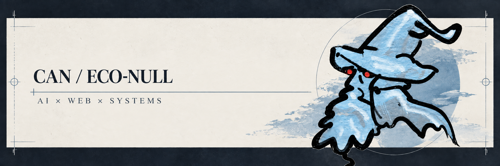

  

  <strong>IT student building practical software</strong> 
  AI, web development, and self-hosted systems.

## About

I build focused tools and applications with an emphasis on clarity, maintainability, and useful outcomes.

## Focus

- AI and automation
- Web applications
- Self-hosted systems
- Developer experience

## Stack

TypeScript · JavaScript · React · Next.js · Tailwind CSS · Supabase · Python · Docker
